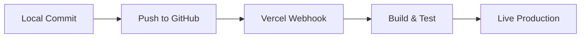

# Goat Breed Registry — Comprehensive Documentation
**Project: goat-registry-next**  
**Last updated: June 2026**  
**Audience: Maintenance Engineers & Client Handoff**  

---

## Table of Contents

1. [Project & Architecture Overview](#1-project--architecture-overview)
2. [Tech Stack](#2-tech-stack)
3. [Infrastructure, Domain & Hosting](#3-infrastructure-domain--hosting)
4. [Security & Credentials Policy](#4-security--credentials-policy)
5. [Directory Structure](#5-directory-structure)
6. [Database Schema & Overview](#6-database-schema--overview)
7. [Custom Code Catalog](#7-custom-code-catalog)
8. [Deployment & Release Process](#8-deployment--release-process)
9. [Third-Party Integrations](#9-third-party-integrations)
10. [Troubleshooting & Common Fixes](#10-troubleshooting--common-fixes)
11. [Running & Testing Locally](#11-running--testing-locally)

---

## 1. Project & Architecture Overview

The **Goat Breed Registry** (Племенной Реестр Коз) is the official software system for the **Association of Breeding Goats** (Ассоциация Племенных Коз). It allows breeders, administrators, and association members to:
* Search and filter the registered goat population.
* Manage farm details, stock lists, and owner allocations.
* Track individual animal profiles including multi-generational lineage (pedigree charts), offspring, and official productivity records.
* Generate and print standardized breeding certificates (Certificates of Conformity / Pedigree Certificates).

### Architectural Migration
The system was migrated from a legacy PHP/MySQL application. To preserve database compatibility and historical records, the underlying database schema remains identical to the legacy system. The frontend was rebuilt from scratch as a modern, high-performance Next.js application.

---

## 2. Tech Stack

| Component | Technology | Description |
|---|---|---|
| **Framework** | Next.js 16+ (App Router) | React framework utilizing Server Components and Server Actions. |
| **Language** | TypeScript 5 | Static typing for data schemas and UI components. |
| **Styling** | Tailwind CSS v4 | Utility-first CSS framework for responsive, modern interfaces. |
| **Database** | PostgreSQL (via `pg` driver) | Relational database hosting the migrated schema. |
| **Icons** | Lucide React | Clean, scalable vector icons. |
| **Typography** | Google Fonts (Inter, Outfit) | Premium, highly readable fonts loaded via Next.js Font Optimization. |
| **Feedback** | react-hot-toast | Non-blocking visual notifications for form submissions. |

> [!NOTE]
> **Why no ORM?** The database schema was migrated as-is from a legacy PHP system (using unusual column casing, MD5 password hashing, etc.). Writing raw SQL queries via the `pg` client avoided mapping conflicts and allowed highly optimized recursive queries.

---

## 3. Infrastructure, Domain & Hosting

### Domain Names & DNS
* **Primary Domain:** `registry-next.kozovodstvo.center` (or custom association domain).
* **Domain Registrar:** Managed via the client's registrar account (e.g., Hostinger, GoDaddy, or Reg.ru).
* **DNS Configuration:** Points to Vercel's global edge network CNAME (`cname.vercel-dns.com`).

### Hosting Providers
1. **Application Hosting (Vercel):**
   * The Next.js application is hosted on Vercel, providing automatic serverless scaling, global CDN edge caching, and automated Git deployments.
2. **Database Hosting (Supabase):**
   * The PostgreSQL database is hosted on a managed Supabase instance. Supabase handles database scaling, connection pooling, and automated daily backups.

---

## 4. Security & Credentials Policy

> [!CAUTION]
> **CRITICAL SECURITY REQUIREMENT**  
> Never store passwords, API keys, database connection strings, or FTP/SSH credentials directly in this document, in code comments, or in the Git repository.

### Shared Password Vault
All production and staging credentials must be stored securely in a shared team vault such as **1Password** or **Bitwarden**. 

The vault must contain the following credentials:
* **Domain Registrar:** Login credentials for the domain control panel.
* **Supabase Console:** Master admin account and database credentials.
* **Vercel Console:** Admin login for the organization's hosting team.
* **GitHub Repository:** Owner/Admin credentials or deploy keys.
* **Database Connection Strings:**
  * Direct connection string (for migrations).
  * Transaction Pooler connection string (for the Next.js runtime).

---

## 5. Directory Structure

```
goat-registry-next/
├── app/                        # Next.js App Router Pages
│   ├── layout.tsx              # Root Layout (Navbar, Header, Toast container)
│   ├── globals.css             # Tailwind imports and global style overrides
│   ├── catalog/                # Breed directory routes
│   ├── farms/                  # Farm profiles and registry indexes
│   ├── goats/                  # Individual goat profiles, certificates, and metrics
│   │   ├── [id]/
│   │   │   ├── page.tsx        # Goat Profile (pedigree, tables, cert selections)
│   │   │   └── certificate/
│   │   │       └── [type]/
│   │   │           └── page.tsx # Official Printable Certificates (Type 1 & 2)
│   │   └── ...
│   └── ...
├── components/                 # Reusable React UI Components
│   ├── BreedEditForm.tsx       # Breed manager edit interface (with image previews)
│   ├── LactationTable.tsx      # Combined own, ancestor, and descendant lactation grid
│   ├── PedigreeNode.tsx        # Render logic for ancestral trees
│   └── ...
├── lib/                        # Data & Logic Core
│   ├── db.ts                   # PostgreSQL connection pool and SSL configurations
│   ├── goats-data.ts           # Centralized database query library
│   ├── actions.ts              # Next.js Server Actions (login, language, forms)
│   ├── access-control.ts       # Authentication checks and role-based guards
│   └── translations.ts         # Multilingual translation dictionaries (RU/EN/UK)
├── public/                     # Static files (images, icons, uploads)
└── package.json                # Dependencies and run scripts
```

---

## 6. Database Schema & Overview

The PostgreSQL database maintains the structure of the legacy MySQL schema to ensure continuous operation of legacy tools and scripts.

### Primary Tables
* **`animals`**: Holds core identity (ID, Name, Sex [1 = Male, 2 = Female], Mother ID, Father ID, Farm ID, Owner, Status).
* **`goats_data`**: Stores auxiliary registration parameters (UA codes, chip numbers, breed ID, studbook ID, horn status, birth weight, blood purity percentage).
* **`farms`**: Profile information for breeding farms.
* **`users`**: Login credentials (password hashed using MD5), emails, and security roles (`role >= 10` indicates administrator permissions).
* **`breeds`**: Predefined breed categories and aliases (used to build short URL routes).

### Data Metrics & Linkages
* **`goats_lact`**: Stores lactation records (milk volume in kg, fat %, protein %, duration in days).
* **`goats_test`**: Contains official body measurements and expert score assessments.
* **`goats_cert`**: Remembers which specific lactation records are selected to print on the animal's breeding certificate.

---

## 7. Custom Code Catalog

The codebase contains several high-impact custom systems developed specifically for this application:

### A. Recursive Pedigree Tree Query
* **Location:** `lib/goats-data.ts` (functions `getAncestors` and `getAncestorLactations`)
* **What it does:** Uses a recursive PostgreSQL Common Table Expression (CTE) to traverse the `animals` table, walking up the paternal and maternal parent links to retrieve a complete 4-generation pedigree tree in a single database round-trip.
* **Why:** Replaces nested, slow legacy PHP queries with a single, highly performant query.

### B. Print Layout Engine (A4 Landscapes & Centering)
* **Location:** `app/goats/[id]/certificate/[type]/page.tsx`
* **What it does:** Renders highly precise, printable layouts matching official pre-printed paper templates.
  * Hides browser-default print headers/footers (date, URL, page numbers) using the `@page { margin: 0; }` directive.
  * Centers the certificate table on A4 landscape paper by applying a strict top padding (`padding-top: 2.0cm`) and zeroing out bottom padding to fit on exactly **1/1 page** without spilling over.
* **Why:** Standardizes print sizing across different web browsers and ensures compatibility with physical certificate stationery.

### C. Real-Time Image Upload Previews
* **Location:** `components/BreedEditForm.tsx` (and animal forms)
* **What it does:** Utilizes React state and the browser's native `URL.createObjectURL(file)` API to display immediate image previews and thumbnails when a user selects a file for upload. Revokes the object URL on file removal to prevent memory leaks.
* **Why:** Gives immediate visual feedback to the user before submitting forms to the server.

---

## 8. Deployment & Release Process

Deployments are automated through **Vercel's Git Integration**.



### Steps to Deploy Updates
1. **Local Validation:** Run a local build to catch any TypeScript, ESLint, or syntax errors:
   ```bash
   npm run build
   ```
2. **Push to GitHub:** Push the changes to the tracked branch:
   ```bash
   git push origin main
   ```
3. **Automatic Deployment:** Vercel detects the commit, runs the build command, optimizes assets, and deploys the new version live.
4. **Environment Updates:** If you add new environment variables, add them in the **Vercel Project Settings -> Environment Variables** panel before pushing the code.

---

## 9. Third-Party Integrations

The system is designed to be self-contained for maximum security and data privacy. The only third-party integrations are:
1. **Google Fonts API:** Integrates the *Inter* and *Outfit* fonts dynamically at build time using Next.js optimization libraries.
2. **Supabase Database Engine:** Cloud-based hosting for the PostgreSQL database, providing continuous connections and automated backups.

---

## 10. Troubleshooting & Common Fixes

### A. Print Layout Showing 2 Pages (Blank Second Page)
* **Symptom:** Opening the print dialog shows a second page that is completely blank.
* **Cause:** The page height exceeds the physical A4 paper height (21.0 cm in landscape). This is usually caused by using `min-h-screen` (which scales to the screen viewport height, not the print size) or applying excessive bottom padding.
* **Fix:** 
  1. Add a unique page class (e.g., `.cert-page-container`) and override the heights under the print media query:
     ```css
     @media print {
       .cert-page-container {
         min-height: 0 !important;
         height: 100% !important;
         overflow: hidden !important;
       }
     }
     ```
  2. Reduce `padding-bottom` to `0` on the body element.

### B. Browser Headers and Footers Appearing on Printouts
* **Symptom:** Printed certificates show dates, titles, page numbers, or local URLs at the margins.
* **Fix:** Set the page margin to zero in the print styles. The browser will automatically hide all headers and footers. Re-apply the margins as padding on the body element:
  ```css
  @media print {
    @page { size: A4 landscape; margin: 0; }
    body {
      padding-top: 2.0cm !important;
      padding-bottom: 0 !important;
      padding-left: 0.5cm !important;
      padding-right: 0.5cm !important;
    }
  }
  ```

### C. Productivity Data Missing (Empty Tables on Profile)
* **Symptom:** The Lactation Data or Productivity table displays "No Records Found" even though records exist in the database.
* **Cause:** A property name mismatch between the data fetching library and the table rendering component (e.g., checking for `.lactations` instead of `.ownLactations` or `.daughtersLactations`).
* **Fix:** Ensure the component supports the correct array properties in `LactationTable.tsx`:
  ```typescript
  const lactations = pathNode?.ownLactations || pathNode?.lactations || [];
  ```

---

## 11. Running & Testing Locally

### Prerequisites
* **Node.js:** v18.18.0 or higher.
* **PostgreSQL:** Access to a PostgreSQL database (Supabase credentials or a local docker container running the schema).

### Development Command
To start the local development server with hot-reloading:
```bash
npm run dev
```

### Production Build Validation
To compile, run TypeScript checks, and output the production bundle:
```bash
npm run build
```
Always run this command before committing code to ensure that no compile-time errors block the Vercel deployment pipeline.
